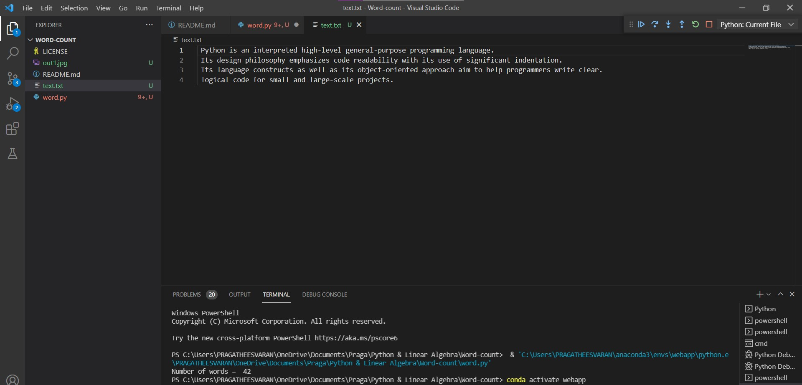

# Word-count
## AIM:
To write a python program for getting the word count from a text.
## EQUIPEMENT'S REQUIRED: 
PC
Anaconda - Python 3.7
## ALGORITHM: 
### Step 1:
Open visual studio code.
### Step 2:
Create file with .py extension.
### Step 3:
Start the program. 
### Step 4:
Write the code.
### Step 5:
Run terminal for output of the given program.
### Step 6:
End the program

## PROGRAM: 
'''
Developed by pragtheesvaran ab
Reference no 21003592
To write a program for getting the word count from a file...'''
```
num_of_words = 0 
file = open('text.txt')
text = file.read()
words = text.split()
num_of_words = len(words)
print("Number of words = ",num_of_words)   
```
### OUTPUT:



## RESULT:
Thus the program is written to find the word count from a text.
